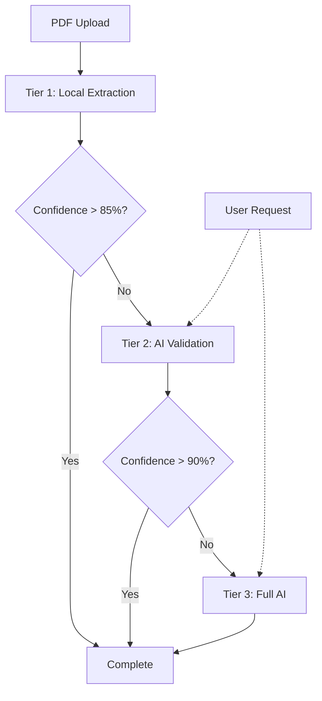

# Three-Tier Progressive PDF Processing System

## Overview

The InvoiceAI progressive processing system implements a three-tier architecture designed to optimize both processing speed and accuracy while minimizing API costs. The system progressively escalates from fast local extraction to full AI processing only when necessary.

## Architecture

### Tier 1: Local Extraction (Fast & Free)
- **Processing Time**: ~0.5-2 seconds
- **Cost**: $0 (no API calls)
- **Accuracy**: 70-90% for standard French invoices
- **Method**: Pattern matching and text position analysis

### Tier 2: Smart AI Validation (Balanced)
- **Processing Time**: ~2-5 seconds
- **Cost**: ~$0.001-0.005 per invoice
- **Accuracy**: 85-95%
- **Method**: Validates only low-confidence fields from Tier 1

### Tier 3: Full AI Extraction (Comprehensive)
- **Processing Time**: ~5-10 seconds
- **Cost**: ~$0.015-0.03 per invoice
- **Accuracy**: 95-99%
- **Method**: Complete Claude 4 Opus vision processing

## API Endpoints

### 1. Progressive Upload
```
POST /api/invoices/upload-progressive
```

Upload an invoice with progressive processing.

**Parameters:**
- `file`: Invoice file (PDF/PNG/JPG)
- `max_tier`: Maximum processing tier (tier1/tier2/tier3)

**Example:**
```bash
curl -X POST http://localhost:8000/api/invoices/upload-progressive \
  -H "Authorization: Bearer YOUR_TOKEN" \
  -F "file=@invoice.pdf" \
  -F "max_tier=tier2"
```

### 2. WebSocket Updates
```
WS /api/invoices/ws/{invoice_id}
```

Real-time processing updates via WebSocket.

**Example (JavaScript):**
```javascript
const ws = new WebSocket(`ws://localhost:8000/api/invoices/ws/${invoiceId}`);

ws.onmessage = (event) => {
  const update = JSON.parse(event.data);
  console.log(`Processing ${update.data.tier}: ${update.data.message}`);
};
```

### 3. Upgrade Processing Tier
```
POST /api/invoices/{invoice_id}/upgrade-tier
```

Request higher-tier processing for better accuracy.

**Parameters:**
- `target_tier`: Target tier (tier2/tier3)

### 4. Processing Details
```
GET /api/invoices/{invoice_id}/processing-details
```

Get detailed processing information including tier results and confidence scores.

## Processing Flow



## Tier 1: Local Extraction Details

### Supported Fields
- **Business Identifiers**: SIREN, SIRET, TVA numbers
- **Invoice Metadata**: Invoice number, dates
- **Financial Data**: Total HT, TVA, Total TTC
- **Entities**: Vendor and customer names

### Pattern Matching
```python
# SIREN: 9 digits
SIREN_PATTERN = r'\b(\d{3}[\s\-]?\d{3}[\s\-]?\d{3})\b'

# SIRET: 14 digits
SIRET_PATTERN = r'\b(\d{3}[\s\-]?\d{3}[\s\-]?\d{3}[\s\-]?\d{5})\b'

# French TVA
TVA_PATTERN = r'\b(FR[\s]?[0-9A-Z]{2}[\s]?\d{3}[\s]?\d{3}[\s]?\d{3})\b'

# French amounts (1 234,56 €)
AMOUNT_PATTERN = r'(\d{1,3}(?:\s?\d{3})*(?:,\d{1,2})?)\s*€'
```

### Confidence Scoring
- **High (0.9-1.0)**: Exact pattern match with context keywords
- **Medium (0.7-0.9)**: Pattern match without strong context
- **Low (< 0.7)**: Weak match or ambiguous context

## Tier 2: Smart AI Validation

### Field Selection
Fields are selected for AI validation if:
1. Confidence < 0.7 (any field)
2. Confidence < 0.85 (critical fields: invoice number, totals, tax IDs)
3. Required fields are missing

### Prompt Optimization
```python
# Minimal prompt for specific field validation
prompt = f"""
Field: {field_name}
Current value: {current_value}
Confidence: {confidence:.2f}
Context: {surrounding_text[:500]}

Validate or correct this value.
"""
```

### Token Usage
- Average: 200-500 tokens per validation
- Grouped validations reduce API calls
- Only uncertain fields are processed

## Tier 3: Full AI Processing

Used when:
- Tier 2 confidence still < 90%
- Complex invoice layouts
- Non-standard formats
- User explicitly requests

## Database Schema

### Processing Metrics Table
```sql
CREATE TABLE processing_metrics (
    id UUID PRIMARY KEY,
    invoice_id UUID REFERENCES invoices(id),
    processing_tier VARCHAR(20),
    tier_sequence INTEGER,
    started_at TIMESTAMP WITH TIME ZONE,
    completed_at TIMESTAMP WITH TIME ZONE,
    processing_time_seconds FLOAT,
    token_usage JSONB,
    confidence_scores JSONB,
    fields_extracted JSONB,
    corrections_made JSONB,
    error_message TEXT
);
```

### Invoice Table Extensions
```sql
ALTER TABLE invoices ADD COLUMN processing_tier VARCHAR(20);
ALTER TABLE invoices ADD COLUMN max_tier_used VARCHAR(20);
ALTER TABLE invoices ADD COLUMN overall_confidence FLOAT;
ALTER TABLE invoices ADD COLUMN field_confidence_scores JSONB;
ALTER TABLE invoices ADD COLUMN tier_progression JSONB;
ALTER TABLE invoices ADD COLUMN total_token_usage INTEGER;
```

## Cost Analysis

### Typical Processing Costs
- **Standard Invoice (Tier 1 only)**: $0
- **Invoice with validation (Tier 1+2)**: ~$0.003
- **Complex Invoice (Tier 1+2+3)**: ~$0.02

### Monthly Estimates (1000 invoices)
- 70% Tier 1 only: $0
- 20% Tier 1+2: $0.60
- 10% Full pipeline: $2.00
- **Total: ~$2.60/month**

## Performance Metrics

### Processing Speed
| Tier | Average Time | 95th Percentile |
|------|--------------|-----------------|
| Tier 1 | 1.2s | 2.5s |
| Tier 2 | 3.5s | 5.0s |
| Tier 3 | 7.0s | 10.0s |

### Accuracy Rates
| Field Type | Tier 1 | Tier 2 | Tier 3 |
|------------|--------|--------|--------|
| Invoice Number | 85% | 95% | 99% |
| SIREN/SIRET | 90% | 98% | 99% |
| Amounts | 80% | 92% | 98% |
| Dates | 88% | 96% | 99% |

## Configuration

### Environment Variables
```bash
# Processing configuration
TIER1_CONFIDENCE_THRESHOLD=0.85
TIER2_CONFIDENCE_THRESHOLD=0.90
MAX_TIER_DEFAULT=tier3

# Cost controls
DAILY_TIER3_LIMIT=100
MONTHLY_TOKEN_BUDGET=1000000
```

### Per-User Limits
```python
# User subscription tiers
TIER_LIMITS = {
    "free": {"max_tier": "tier1", "monthly_invoices": 10},
    "starter": {"max_tier": "tier2", "monthly_invoices": 100},
    "pro": {"max_tier": "tier3", "monthly_invoices": 1000},
    "enterprise": {"max_tier": "tier3", "monthly_invoices": None}
}
```

## Error Handling

### Fallback Strategy
1. Tier 1 fails → Skip to Tier 3
2. Tier 2 fails → Use Tier 1 results
3. Tier 3 fails → Return best available data

### Retry Logic
- Tier 1: No retries (local processing)
- Tier 2: 1 retry with backoff
- Tier 3: 2 retries with exponential backoff

## Monitoring

### Key Metrics
- Tier distribution (% processed at each tier)
- Average confidence scores by tier
- Processing time percentiles
- Token usage trends
- Cost per invoice

### Alerts
- Tier 1 success rate < 60%
- Average processing time > 10s
- Daily token usage > 80% of budget
- Error rate > 5%

## Future Enhancements

1. **Machine Learning Optimization**
   - Learn from Tier 2/3 corrections to improve Tier 1
   - Adaptive confidence thresholds per field type

2. **Layout Analysis**
   - Add geometric analysis to Tier 1
   - Table extraction improvements

3. **Multi-language Support**
   - Extend patterns for other European formats
   - Localized validation rules

4. **Caching Layer**
   - Cache Tier 1 patterns by vendor
   - Reuse extraction templates